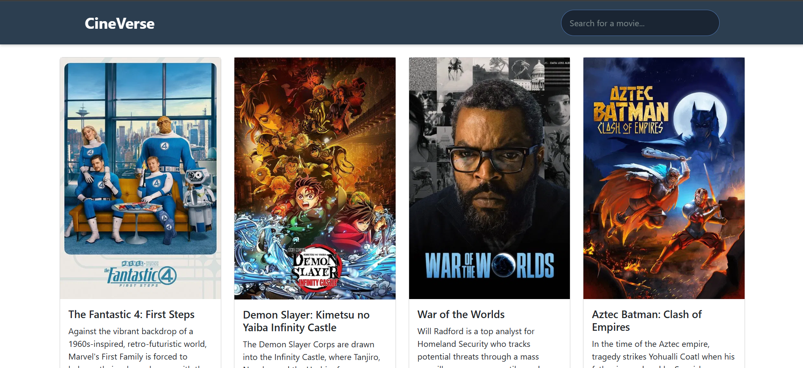
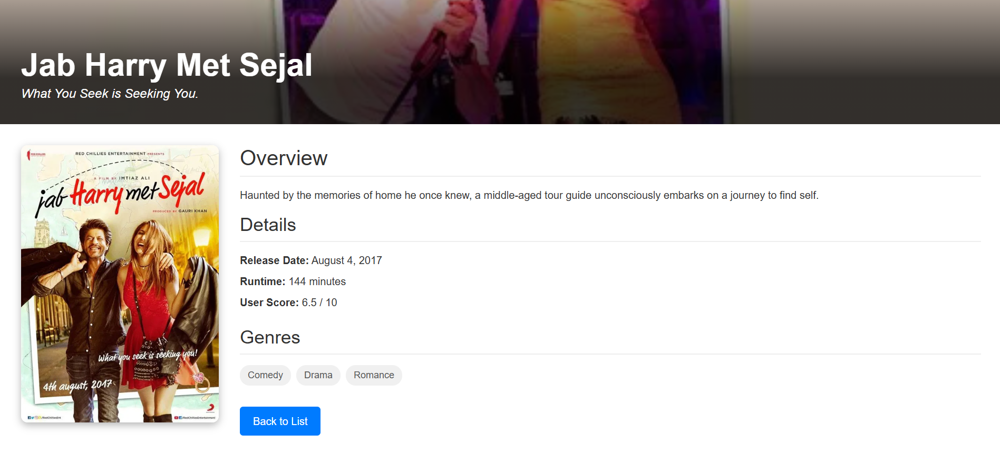
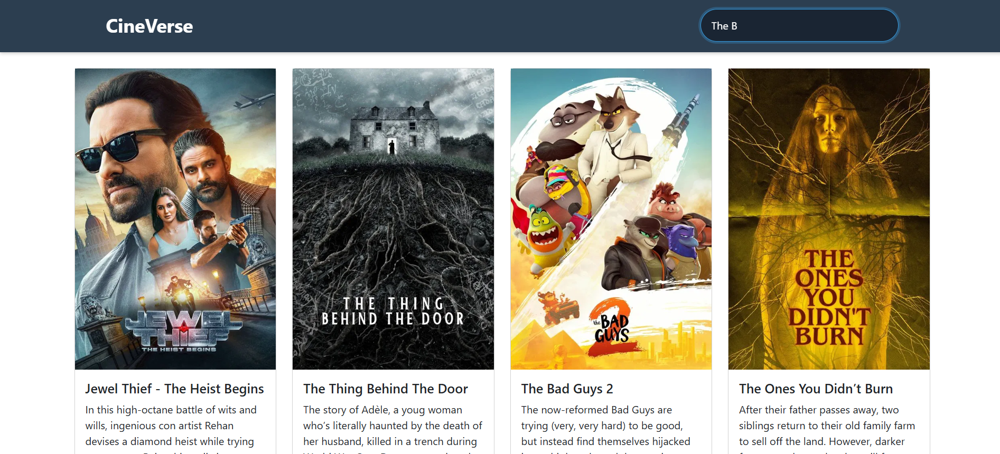

# Cineverse Dashboard

A responsive web application where users can browse popular movies and TV shows, search for content, and view detailed information. Built with Angular 16 and TypeScript, Cineverse Dashboard provides an engaging interface for discovering the latest in entertainment.

Live demo: [cineverse-dashboard.vercel.app](https://cineverse-dashboard.vercel.app)

---

## Table of Contents

- [Features](#features)
- [Screenshots](#screenshots)
- [Getting Started](#getting-started)
  - [Installation](#installation)
  - [Development Server](#development-server)
  - [Build](#build)
  - [Testing](#testing)
- [Folder Structure](#folder-structure)
- [Contributing](#contributing)
- [License](#license)
- [Contact](#contact)

---

## Features

- **Browse Popular Movies**: View a curated list of trending and popular movies.
- **Search Functionality**: Instantly search for movies by title.
- **Movie Details Page**: View detailed information including overview, genres, release date, runtime, user score, and more.
- **Responsive Design**: Optimized for all devices.
- **Error Handling and Loader**: User-friendly error messages and loading states.
- **Modular Angular Architecture**: Features reusable components, modules, and services.

---

## Screenshots

### Home Page
The Home Page displaying a list of popular movies.



### Movie Details Page
The Movie Details Page displaying the details of the movie such as overview, runtime, user rating, etc.



### Search Results
The page displaying the search results.



---

## Getting Started

### Prerequisites

- [Node.js](https://nodejs.org/) (v16+ recommended)
- [Angular CLI](https://angular.io/cli) (`npm install -g @angular/cli`)

### Installation

Clone the repository:

```bash
git clone https://github.com/Zafar7645/cineverse-dashboard.git
cd cineverse-dashboard/client/cineverse-dashboard
npm install
```

### Development Server

Run the development server:

```bash
ng serve
```
Navigate to `http://localhost:4200/`. The app will automatically reload if you change any source files.

### Build

To build the project for production:

```bash
ng build
```
The build artifacts will be stored in the `dist/` directory.

### Testing

#### Unit Tests

Run unit tests via [Karma](https://karma-runner.github.io):

```bash
ng test
```

#### End-to-End Tests

To run e2e tests, first add a package that implements end-to-end testing capabilities:

```bash
ng e2e
```

---

## Folder Structure

```
client/cineverse-dashboard/
├── src/
│   ├── app/
│   │   ├── components/           # Reusable UI components (header, movie card, movie list)
│   │   ├── movie-details/        # Movie details module and component
│   │   ├── shared/               # Shared components (loader, error)
│   │   ├── app.module.ts         # Main Angular module
│   │   └── ...                   # Other core files
│   ├── assets/
│   ├── environments/
│   ├── index.html
│   └── main.ts
└── ...
```

---

## Contributing

Contributions are welcome! Please follow these steps:

1. Fork the repository.
2. Create a new branch (`git checkout -b feature/your-feature`).
3. Make your changes.
4. Commit and push (`git commit -am 'Add new feature' && git push origin feature/your-feature`).
5. Open a pull request.

---

## License

_This repository currently does not specify a license._

---

## Contact

- **Author:** [Zafar7645](https://github.com/Zafar7645)
- **Homepage:** [cineverse-dashboard.vercel.app](https://cineverse-dashboard.vercel.app)

---

## Further Help

For more help on the Angular CLI, use `ng help` or refer to the [Angular CLI Overview and Command Reference](https://angular.io/cli).
